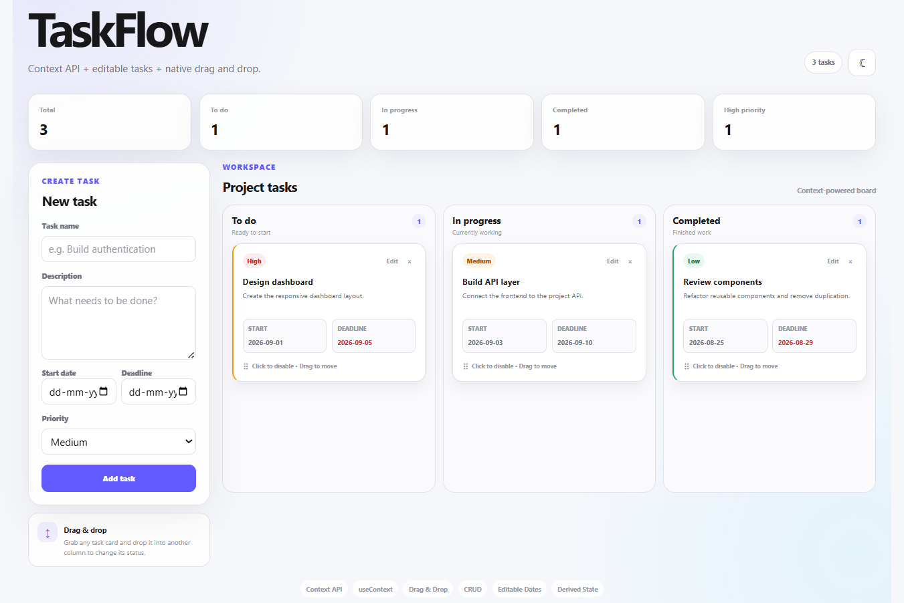
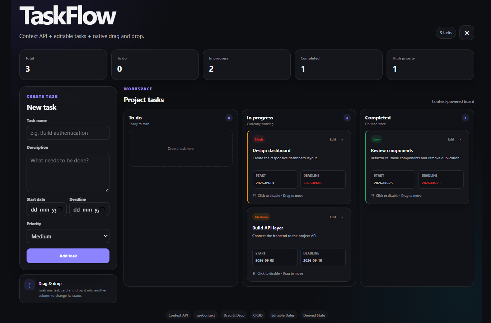

# React Project 09 — Context Task Board + Drag & Drop

This is the upgraded **Context Task Board** project.

It combines Context API with realistic task-management features:

- Native HTML5 drag and drop
- Add tasks
- Edit task name
- Edit description
- Edit start date
- Edit deadline
- Edit priority
- Delete tasks
- Move tasks between columns
- Deadline warnings
- Statistics
- Dark/light theme
- Custom Context hooks
- Derived state

## Run

```bash
npm install
npm run dev
```

## Core architecture

```text
ThemeProvider
      +
TaskProvider
      ↓
     App
      ↓
 ┌────┴─────────────┐
 │                  │
TaskForm         TaskColumn
                   ↓
                TaskCard
```

All task operations come from:

```jsx
const {
  tasks,
  addTask,
  updateTask,
  moveTask,
  deleteTask,
} = useTasks();
```

This avoids passing the same handlers through multiple levels.

## Drag and drop flow

The card is draggable:

```jsx
<article draggable>
```

When dragging starts:

```jsx
event.dataTransfer.setData(
  "text/task-id",
  task.id,
);
```

The column accepts the drag:

```jsx
onDragOver={(event) => {
  event.preventDefault();
}}
```

Then on drop:

```jsx
const taskId = event.dataTransfer.getData("text/task-id");

moveTask(taskId, status);
```

The task status is therefore changed through the Context API.

## Date behavior

Every task has:

```js
{
  startDate: "2026-09-01",
  deadline: "2026-09-05"
}
```

The form prevents a deadline earlier than the start date.

Cards also calculate deadline status:

```text
normal
soon
overdue
complete
```

This is derived from the current date and task state rather than stored as another piece of state.

## Challenges

### Challenge 1 — Reorder tasks

Current drag and drop changes the column.

Upgrade it so tasks can also be reordered inside the same column.

Hint: you'll need to track:

```text
draggedTaskId
targetTaskId
```

and update the array order immutably.

### Challenge 2 — Mobile drag and drop

HTML5 drag and drop has limitations on touch devices.

Research how pointer events or a dedicated drag-and-drop library can provide better mobile behavior.

Do not install a library until you understand the limitation.

### Challenge 3 — Persist tasks

Use localStorage so tasks survive a browser refresh.

This combines Project 10's persistence concepts with this project.

### Challenge 4 — Task editing modal

Instead of showing the edit form permanently in the sidebar, create a modal.

The same Context operations should continue to work.

### Challenge 5 — Deadline filtering

Add:

```text
All
Due soon
Overdue
Completed
```

Keep the filtered lists derived from task state.

### Challenge 6 — Priority filtering

Add:

```text
All
High
Medium
Low
```

### Challenge 7 — Sorting

Add:

```text
Deadline
Priority
Newest
Oldest
```

Do not mutate the original state array when sorting.

### Challenge 8 — Combine Context + useReducer

Replace TaskContext's `useState` with `useReducer`.

Create actions:

```text
ADD_TASK
UPDATE_TASK
MOVE_TASK
DELETE_TASK
REORDER_TASK
CLEAR_TASKS
```